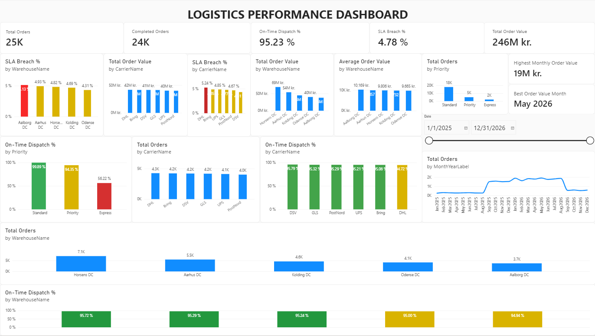
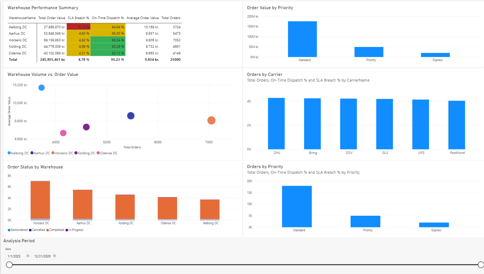

# Logistics Performance Dashboard — Power BI

Interactive logistics performance dashboard developed in Microsoft Power BI to analyze warehouse, carrier and order-priority performance.

### 📊 Live Interactive Dashboard

[Open the Logistics Performance Dashboard](https://app.powerbi.com/view?r=eyJrIjoiZmM0MWMyNGYtZjM1Ny00ZWYxLTljNjItYTkwOTEwMTBiOTZhIiwidCI6IjlhOWMwOTM4LWRjZWUtNGFlOS04ZmE1LTYyM2I0YWVkYTJkNyJ9)

[Download the Power BI project (.pbix)](./Logistics_Performance_Dashboard_PowerBI.pbix)

## Dashboard Preview

### Overview

### Logistics Analysis

## Project Highlights

- **25,000 orders** analysed across the dataset
- **5 distribution centres** compared
- **6 carriers** analysed
- **95.23% overall on-time dispatch**
- **4.78% overall SLA breach rate**
- Warehouse performance comparison
- Carrier performance analysis
- Priority and service-level analysis
- Order volume and order value trends
- Interactive date filtering
- DAX measures for operational KPIs
- Dimensional data model using fact and dimension tables
- Power BI dashboard published as an interactive web report

 ## Technology & Skills

- **Power BI** — dashboard design, interactive reporting and data visualization
- **DAX** — KPI calculations, time intelligence and business metrics
- **Power Query** — data transformation, cleaning and type handling
- **Data Modelling** — fact and dimension tables with relationships
- **Dimensional Modelling** — structured warehouse-style reporting model
- **Logistics Analytics** — warehouse, carrier, priority and SLA performance
- **KPI Development** — order volume, order value, AOV, on-time dispatch and SLA breach analysis

## Key Business Insights

- **Horsens DC** handles the highest order volume and order value, making it the largest operational site in the dataset.
- **Odense DC** achieves the strongest on-time dispatch performance at **95.72%** and the lowest SLA breach rate at **4.31%**.
- **Aalborg DC** has the highest SLA breach rate at **5.13%** and the lowest on-time dispatch performance at **94.94%**, indicating a potential area for operational improvement.
- **Express orders** have significantly lower on-time performance at **56.22%**, compared with **94.35%** for Priority and **99.89%** for Standard orders.
- **DSV** has the strongest carrier on-time performance at **95.79%**, while **DHL** is lowest at **94.72%** and has the highest SLA breach rate.
- The dashboard enables comparison of **warehouse, carrier and priority performance** to identify operational gaps and improvement opportunities.
  
## Project Overview

This project demonstrates how operational logistics data can be transformed into an interactive business intelligence dashboard for monitoring order volume, order value, service performance and SLA compliance.

The dashboard is designed to help logistics and operations teams identify performance gaps, compare warehouses and carriers, and investigate operational trends.

## Dataset

The portfolio dataset contains:

- 25,000 orders
- 5 distribution centers
- 6 carriers
- Multiple order priorities and statuses
- Order value and operational performance data
- Data covering 2025–2026

The dataset is used for portfolio and demonstration purposes.

## Dashboard

### Overview

The Overview page provides a high-level view of logistics performance, including:

- Total orders
- Completed orders
- On-time dispatch
- SLA breach rate
- Total order value
- Monthly order trends
- Warehouse performance
- Carrier performance
- Priority performance

### Logistics Analysis

The Logistics Analysis page provides deeper operational analysis through:

- Warehouse performance summary
- Warehouse volume vs. order value
- Orders by carrier
- Order status by warehouse
- Orders by priority
- Order value by priority
- Interactive analysis-period filtering

## Key KPIs

| KPI | Result |
|---|---:|
| Total Orders | 25,000 |
| On-Time Dispatch | 95.23% |
| SLA Breach | 4.78% |
| Total Order Value | 245.9M DKK |
| Highest Monthly Order Value | 18.8M DKK |
| Best Value Month | May 2026 |

## Data Model

The Power BI model uses a dimensional structure consisting of:

- FactOrders
- DimDate
- DimProduct
- DimWarehouse
- DimCustomer
- DimCarrier

DAX measures were developed for operational KPIs and analytical calculations.

## Project Purpose

This project demonstrates the combination of logistics domain knowledge with data analytics and business intelligence skills to support operational decision-making.

